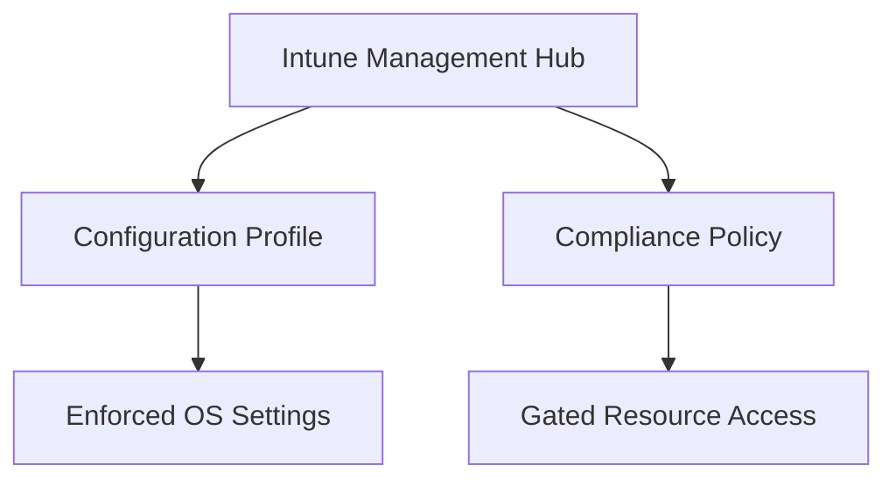
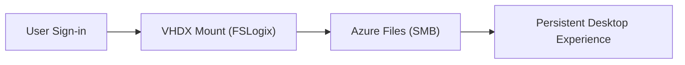
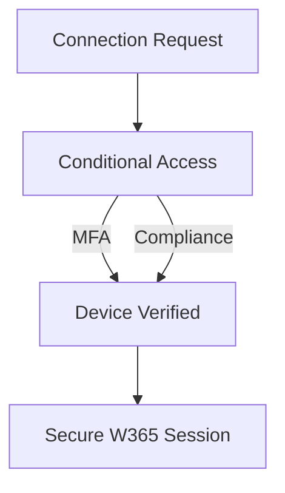
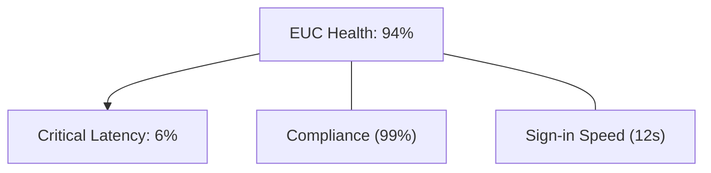
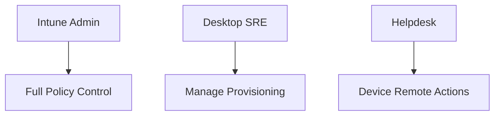
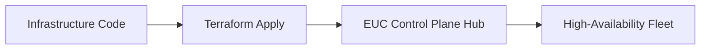

<div align="center">


<h1>Windows 365 Hybrid Platform</h1>

<p><strong>The Strategic Foundation for Enterprise End-User Computing (EUC), Hybrid Identity Integration, and Cloud PC Lifecycle Orchestration.</strong></p>

[]()
[]()
[]()

<br/>

> **"Identity is the new perimeter; the Cloud PC is the new workspace."** 
> **Windows 365 Hybrid** is an enterprise-grade platform designed to provide a secure, measurable, and highly automated foundation for global hybrid workplace transformation. It orchestrates the complex lifecycle of cloud-based endpoints—from identity synchronization and automated Cloud PC provisioning to real-time performance monitoring and Intune-based governance.

</div>

---

## 🏛️ Executive Summary

Legacy VDI and fragmented remote access solutions are strategic operational liabilities; lack of a unified hybrid workspace model is a primary barrier to employee productivity. Organizations fail to scale their hybrid workforce not because of a lack of hardware, but because of fragmented identity standards, lack of automated device lifecycle management, and an inability to monitor user experience with operational precision.

This platform provides the **Hybrid Workspace Intelligence Plane**. It implements a complete **Enterprise EUC-as-Code Framework**, enabling IT Operations and Security teams to manage the modern workspace as a first-class citizen. By automating the provisioning of Windows 365 Cloud PCs and orchestrating real-time compliance policies via Microsoft Intune, we ensure that every organizational endpoint—from contractor laptops to executive desktops—is secure by default, audited for history, and strictly aligned with institutional Zero-Trust standards.

---

## 📐 Architecture Storytelling: Principal Reference Models

### 1. Principal Architecture: Global Windows 365 Hybrid & EUC Control Plane
This diagram illustrates the end-to-end flow from hybrid identity synchronization and secure networking to Cloud PC provisioning, Intune governance, and institutional EUC auditing.

```mermaid
graph LR
    %% Subgraph Definitions
    subgraph IdentityPlane["Hybrid Identity Hub"]
        direction TB
        AD["On-Prem Active Directory"]
        Connect["Entra ID Connect"]
        Entra["Microsoft Entra ID (MFA)"]
    end

    subgraph IntelligenceEngine["EUC Intelligence Hub"]
        direction TB
        API["FastAPI EUC Gateway"]
        Provisioner["Cloud PC Provisioning Engine"]
        Manager["Endpoint Manager (Intune) Hub"]
        Validator["Compliance & Health Hub"]
    end

    subgraph ComputePlane["Windows 365 Fabric"]
        direction TB
        CloudPC["Enterprise Cloud PCs"]
        ANC["Azure Network Connection"]
        Profile["FSLogix Profile Containers"]
    end

    subgraph OperationsHub["Institutional EUC Hub"]
        direction TB
        Scorecard["Fleet Health Scorecard"]
        Analytics["User Experience (DEX) Stats"]
        Audit["Forensic Device Metadata Lake"]
    end

    subgraph DevOps["EUC-as-Code Orchestration"]
        direction TB
        TF["Terraform EUC Modules"]
        VNet["Hybrid Virtual Networking"]
        Defender["XDR (Defender for Endpoint)"]
    end

    %% Flow Arrows
    IdentityPlane -->|1. Sync Identity| API
    API -->|2. Request Provision| Provisioner
    Provisioner -->|3. Establish Network| ANC
    ANC -->|4. Deploy Resource| CloudPC
    
    CloudPC -->|5. Apply Config| Manager
    Manager -->|6. Verify Compliance| Validator
    Validator -->|7. Secure Session| Defender
    
    API -->|8. Visualize Health| Scorecard
    Scorecard -->|9. Monitor DEX| Analytics
    Scorecard -->|10. Record Event| Audit
    
    TF -->|11. Provision Hub| IntelligenceEngine
    VNet -->|12. Connect On-Prem| ANC
    Profile -->|13. Roam User Data| CloudPC

    %% Styling
    classDef identity fill:#f5f5f5,stroke:#616161,stroke-width:2px;
    classDef intel fill:#e1f5fe,stroke:#01579b,stroke-width:2px;
    classDef compute fill:#ede7f6,stroke:#311b92,stroke-width:2px;
    classDef ops fill:#e0f2f1,stroke:#004d40,stroke-width:2px;
    classDef devops fill:#fffde7,stroke:#f57f17,stroke-width:2px;

    class IdentityPlane identity;
    class IntelligenceEngine intel;
    class ComputePlane compute;
    class OperationsHub ops;
    class DevOps devops;
```



### 2. The Cloud PC Lifecycle Flow
The continuous path of a virtual workspace from initial licensing and provisioning to active management, security hardening, and forensic retirement.


### 3. Hybrid Identity Synchronization Flow
Strategically bridging on-premises Active Directory with Microsoft Entra ID (Azure AD) to enable seamless, single-sign-on access to virtualized corporate resources.


### 4. Secure Hybrid Networking Topology
Orchestrating the critical line-of-sight between Cloud PCs in Azure and on-premises domain controllers using Azure Network Connections (ANC) and VPC injection.


### 5. Intune Policy & Compliance Hub
Automating the deployment of Configuration Profiles (Settings) and Compliance Policies (Gates) to ensure every Cloud PC meets the enterprise security baseline.



### 6. FSLogix & Profile Roaming Architecture
Integrating Azure Files or NetApp Files to ensure persistent, high-performance user profiles that roam seamlessly between persistent and non-persistent virtual sessions.



### 7. Zero-Trust Conditional Access Flow
Enforcing real-time, context-aware gating (MFA, Device Compliance, IP Location) before a user is permitted to establish a session with their Cloud PC.



### 8. Institutional EUC Health Scorecard
Grading organizational performance based on key indicators: Deployment Velocity, Compliance Adherence, and User Experience (DEX) Latency.



### 9. Identity & RBAC for EUC Governance
Managing fine-grained access to Intune policies, provisioning queues, and device logs between Intune Admins, Desktop Engineers, and Support Teams.



### 10. IaC Deployment: EUC-as-Code Framework
Using Terraform to deploy and manage the versioned distribution of the EUC control plane, network connectors, and profile storage infrastructure.



### 11. Metadata Lake for Forensic Device Audit
Storing long-term records of every device sign-in, configuration change, and remediation event for institutional investigation and compliance.


---

## 🏛️ Core EUC Pillars

1.  **Unified Hybrid Identity**: Seamlessly bridging on-prem Active Directory and Entra ID for a frictionless SSO experience.
2.  **Automated Workspace Lifecycle**: Moving from manual imaging to rapid, policy-driven Cloud PC provisioning.
3.  **Modern Device Management**: Centralizing all endpoint governance through Microsoft Intune (MDM/MAM).
4.  **Zero-Trust Connectivity**: Hard-fencing workspace access based on real-time identity and device health signals.
5.  **Persistent Experience Performance**: Leveraging FSLogix and Azure Files for ultra-fast, roaming user profiles.
6.  **Full Auditability**: Immutable recording of every workspace interaction and configuration change for institutional record-keeping.

---

## 🛠️ Technical Stack & Implementation

### EUC Engine & APIs
*   **Framework**: Python 3.11+ / FastAPI.
*   **Provisioning Core**: Custom logic for orchestrating Windows 365 provisioning policies and ANC validation.
*   **Identity Orchestrator**: Integration with Entra ID Connect and Microsoft Graph for user/group management.
*   **Compliance Hub**: Intelligent engine for monitoring Intune policy adherence and health attestation.
*   **State Management**: PostgreSQL (Metadata Lake) and Redis (Device Session Cache).

### EUC Dashboard (UI)
*   **Framework**: React 18 / Vite.
*   **Theme**: Slate, Cyan, Indigo (Modern operational aesthetic).
*   **Visualization**: Recharts for fleet compliance heatmaps, session latency trends, and license utilization.

### Infrastructure & DevOps
*   **Runtime**: AWS EKS or Azure Kubernetes Service (AKS).
*   **Networking**: Azure Network Connections (ANC) for direct VNet injection of Cloud PCs.
*   **IaC**: Modular Terraform for deploying the EUC hub and hybrid networking distributions.

---

## 🏗️ IaC Mapping (Module Structure)

| Module | Purpose | Real Services |
| :--- | :--- | :--- |
| **`infrastructure/euc_hub`** | Central management plane | EKS, PostgreSQL, Redis |
| **`infrastructure/networking`** | Hybrid connectivity fabric | VNet, VPN, ExpressRoute |
| **`infrastructure/storage`** | Profile & Data Roaming | Azure Files, FSLogix |
| **`infrastructure/governance`** | Intune & CA Policies | Intune, Entra ID |

---

## 🚀 Deployment Guide

### Local Principal Environment
```bash
# Clone the EUC platform
git clone https://github.com/devopstrio/windows-365-hybrid.git
cd windows-365-hybrid

# Configure environment
cp .env.example .env

# Launch the EUC stack
make up

# Trigger a mock identity sync and device provisioning simulation
make simulate-provision
```

Access the Hybrid Dashboard at `http://localhost:3000`.

---

## 📜 License
Distributed under the MIT License. See `LICENSE` for more information.

---
<div align="center">
  <p>© 2026 Devopstrio. All rights reserved.</p>
</div>
