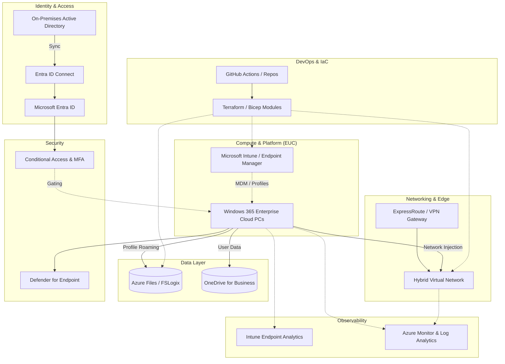

<div align="center">


<h1>Windows 365 Hybrid Platform</h1>

<p><strong>The Strategic Foundation for Enterprise End-User Computing (EUC), Hybrid Identity Integration, and Cloud PC Lifecycle Orchestration using Infrastructure as Code</strong></p>

[]()
[]()
[]()

<br/>

> **"Identity is the new perimeter; the Cloud PC is the new workspace."** 
> Windows 365 Hybrid (Hybrid-PC) is an enterprise-grade platform designed to provide a secure, measurable, and highly automated foundation for global hybrid workplace transformation. It orchestrates the complex lifecycle of cloud-based endpoints—from simulated AD-to-AAD identity synchronization and automated Cloud PC provisioning to real-time performance monitoring, hybrid networking connectivity, and unified Intune-based governance. By providing a centralized command center with unified workspace-as-code blueprints, automated provisioning pipelines, and immutable device logs, it enables organizations to eliminate legacy VDI complexity, ensure secure remote access, and drive rapid digital transformation across the entire enterprise ecosystem.

</div>

---

## 🏛️ Executive Summary

Legacy VDI and fragmented remote access solutions are strategic operational liabilities; lack of a unified hybrid workspace model is a primary barrier to employee productivity. Organizations fail to scale their hybrid workforce not because of a lack of hardware, but because of fragmented identity standards, lack of automated device lifecycle management, and an inability to monitor user experience with operational precision.

This platform provides the **Hybrid Workspace Intelligence Plane**. It implements a complete **Enterprise EUC-as-Code Framework**—from modular Identity and Provisioning engines to specialized Networking and Governance hubs. By operationalizing Cloud PC delivery as a primary architectural pillar, it ensures that your global workforce is not just "connected," but continuously optimized and delivered with strategic performance-aligned precision.

---

## 🏛️ Core Platform Pillars

1. **Hybrid Identity Engine**: High-performance simulation of AD Connect synchronization, bridging on-premises Active Directory with Azure AD (Entra ID).
2. **Cloud PC Provisioning Factory**: Carrier-grade engine for orchestrating the lifecycle of Windows 365 Business and Enterprise Cloud PCs.
3. **Endpoint Governance Hub**: Intelligent orchestration of Intune compliance policies, configuration profiles, and device health validation.
4. **Hybrid Network Topology**: Advanced modeling of virtual networks, VPN/DirectConnect connectivity, and secure hybrid access paths.
5. **EUC Performance Analytics**: Real-time measurement of user session latency, connection success rates, and device utilization trends.
6. **Unified Workspace Dashboard**: Deep observability into identity health, device compliance distribution, and fleet-wide cost modeling.

---

## 📐 High-Level Reference Architecture

### Enterprise Windows 365 Hybrid Integration

**Business Purpose:**  
Provides a secure, fully-managed End-User Computing (EUC) platform that integrates Windows 365 Cloud PCs with on-premises infrastructure. It enforces Zero Trust conditional access, centralizes device governance via Intune, and automates infrastructure delivery through Terraform.



**Key Components:**
- **Hybrid Identity:** Utilizes Entra ID Connect to synchronize on-premises Active Directory accounts, enabling Hybrid Azure AD join for seamless Cloud PC authentication.
- **Windows 365 Enterprise:** Hosts persistent, user-dedicated Cloud PCs that are directly injected into the Azure Virtual Network via Azure Network Connections (ANC).
- **Microsoft Intune:** Centralized Mobile Device Management (MDM) plane for pushing configuration profiles, applications, and compliance policies to the Cloud PCs.
- **Azure Files & FSLogix:** Highly available, SMB-based file storage dynamically mounting user profiles to ensure persistent experiences across ephemeral sessions if required.
- **Conditional Access & Defender:** Enforces strict Zero-Trust gating (MFA, compliant device checks) before a user can connect, backed by real-time XDR scanning from Defender for Endpoint.
- **ExpressRoute / VPN Gateway:** Provides the critical line-of-sight required for Cloud PCs to reach on-premises domain controllers and internal line-of-business applications.

**How this maps to IaC:**
- **`module.network`:** Provisions the Azure Virtual Network, Subnets, Network Security Groups, and VPN/ExpressRoute Gateways required for ANC.
- **`module.identity`:** Configures Azure AD Domain Services or facilitates Hybrid network routing for AD Connect synchronizations.
- **`module.w365`:** Defines the Windows 365 Provisioning Policies, Azure Network Connections, and assigns user licenses.
- **`module.intune`:** Automates the deployment of Intune compliance policies, configuration profiles, and application assignments via Microsoft Graph API.
- **`module.storage`:** Provisions the Azure Storage Account and Azure Files share with AD integration for FSLogix profile containers.

---

## 🛠️ Technical Stack & Implementation

### Platform Engine & APIs
- **Framework**: Python 3.11+ / FastAPI.
- **Identity Engine**: High-performance simulation of AD Connect bridging on-prem AD and Entra ID.
- **Provisioning Engine**: Carrier-grade orchestration of Windows 365 Cloud PC lifecycle.
- **Device Hub**: Intelligent management of Intune compliance and configuration profiles.
- **Networking Hub**: Advanced modeling of hybrid connectivity (VNet, VPN, DirectConnect).
- **Cost Engine**: Real-time estimation of Windows 365 licensing and usage costs.
- **Cache**: Redis for session tracking and real-time device status updates.
- **Persistence**: PostgreSQL for fleet metadata, identity objects, and audit trails.
- **Observability**: Prometheus/Grafana integration for workplace factory monitoring.

### Frontend (Hybrid Command Center)
- **Framework**: React 18 / Vite.
- **Theme**: Slate / Cyan (Modern EUC & Identity aesthetic).
- **Visualization**: Recharts for session trends and device compliance metrics.

### Infrastructure
- **Runtime**: AWS EKS (Kubernetes).
- **Deployment**: Helm charts for provisioning workers and identity gateways.
- **IaC**: Terraform (Modular with EUC Infrastructure focus).

---

## 🚀 Deployment Guide

### Local Development
```bash
# Clone the repository
git clone https://github.com/devopstrio/windows-365-hybrid.git
cd windows-365-hybrid

# Setup environment
cp .env.example .env

# Launch the Hybrid stack (API, Engines, DB, Redis, UI)
make up

# Sync Identity objects (AD -> AAD)
make sync

# Provision initial Cloud PCs
make provision

# Validate workplace architecture
make test
```
Access the Hybrid Dashboard at `http://localhost:3000`.

---

## 📜 License
Distributed under the MIT License. See `LICENSE` for more information.
