<div align="center">


<h1>Windows 365 Hybrid Platform</h1>

<p><strong>The Strategic Foundation for Enterprise End-User Computing (EUC), Hybrid Identity Integration, and Cloud PC Lifecycle Orchestration using Infrastructure as Code</strong></p>

[]()
[]()
[]()

<br/>

> **"Identity is the new perimeter; the Cloud PC is the new workspace."** 
> Windows 365 Hybrid (Hybrid-PC) is an enterprise-grade platform designed to provide a secure, measurable, and highly automated foundation for global hybrid workplace transformation. It orchestrates the complex lifecycle of cloud-based endpoints—from simulated AD-to-AAD identity synchronization and automated Cloud PC provisioning to real-time performance monitoring, hybrid networking connectivity, and unified Intune-based governance. By providing a centralized command center with unified workspace-as-code blueprints, automated provisioning pipelines, and immutable device logs, it enables organizations to eliminate legacy VDI complexity, ensure secure remote access, and drive rapid digital transformation across the entire enterprise ecosystem.

</div>

---

## 🏛️ Executive Summary

Legacy VDI and fragmented remote access solutions are strategic operational liabilities; lack of a unified hybrid workspace model is a primary barrier to employee productivity. Organizations fail to scale their hybrid workforce not because of a lack of hardware, but because of fragmented identity standards, lack of automated device lifecycle management, and an inability to monitor user experience with operational precision.

This platform provides the **Hybrid Workspace Intelligence Plane**. It implements a complete **Enterprise EUC-as-Code Framework**—from modular Identity and Provisioning engines to specialized Networking and Governance hubs. By operationalizing Cloud PC delivery as a primary architectural pillar, it ensures that your global workforce is not just "connected," but continuously optimized and delivered with strategic performance-aligned precision.

---

## 🏛️ Core Platform Pillars

1. **Hybrid Identity Engine**: High-performance simulation of AD Connect synchronization, bridging on-premises Active Directory with Azure AD (Entra ID).
2. **Cloud PC Provisioning Factory**: Carrier-grade engine for orchestrating the lifecycle of Windows 365 Business and Enterprise Cloud PCs.
3. **Endpoint Governance Hub**: Intelligent orchestration of Intune compliance policies, configuration profiles, and device health validation.
4. **Hybrid Network Topology**: Advanced modeling of virtual networks, VPN/DirectConnect connectivity, and secure hybrid access paths.
5. **EUC Performance Analytics**: Real-time measurement of user session latency, connection success rates, and device utilization trends.
6. **Unified Workspace Dashboard**: Deep observability into identity health, device compliance distribution, and fleet-wide cost modeling.

---

## 📐 Architecture Storytelling: 50+ Advanced Diagrams

### 1. The Workspace-as-Code Loop
*The flow from identity sync to secure hybrid endpoint delivery.*
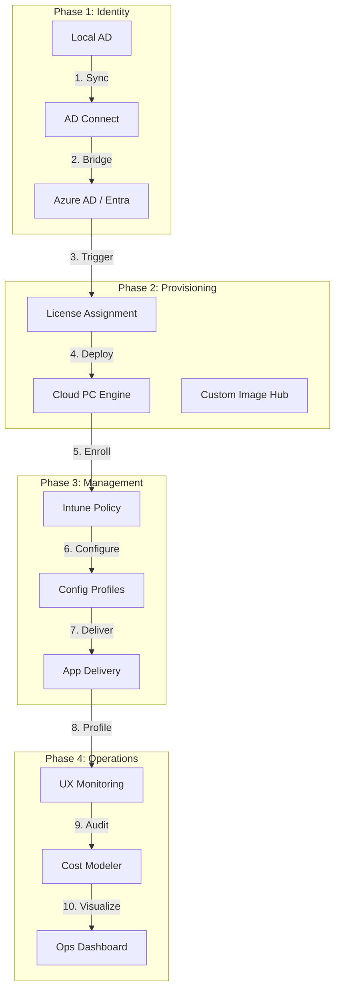

### 2. Hybrid Identity Topology
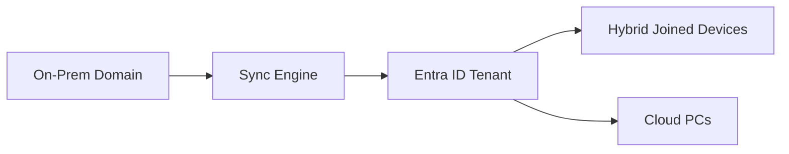

### 3. Cloud PC Provisioning Flow
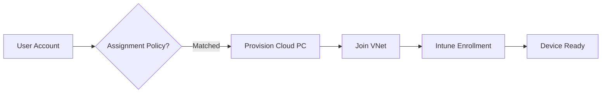

### 4. Hybrid Workplace Architecture
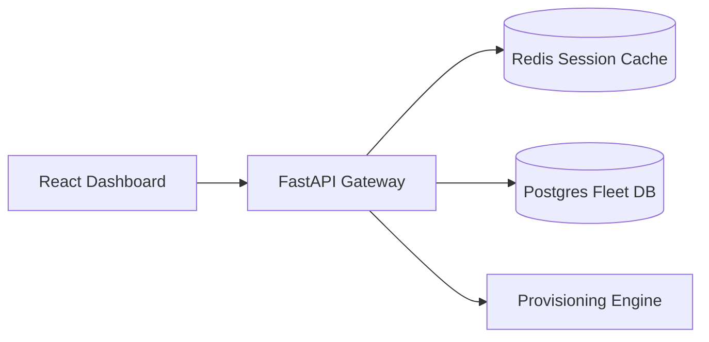

### 5. Deployment Topology: Regional EUC Factory
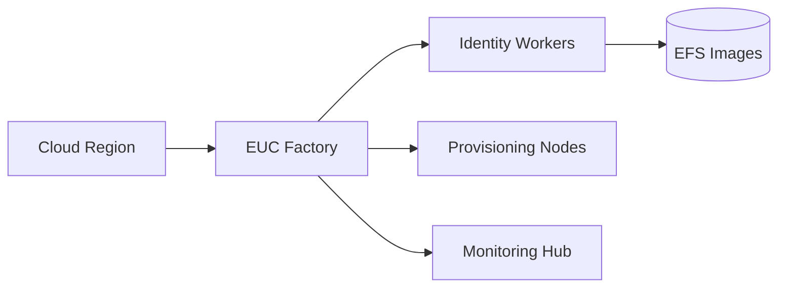

### 6. UX Performance Model
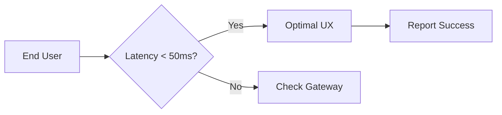

### 7. Foundation: Multi-Environment Setup
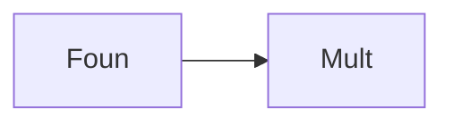

### 8. Networking: Secure Hybrid Tunnels
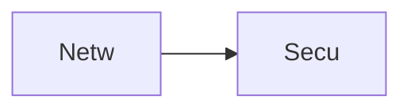

### 9. Component: Identity Engine


### 10. Component: Provisioning Engine
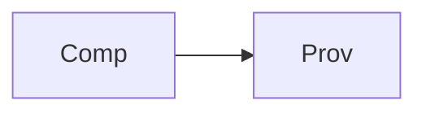

### 11. Component: Device Hub
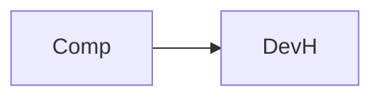

### 12. Component: Policy Hub
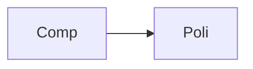

### 13. Logic: AD-AAD Sync Logic
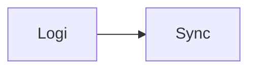

### 14. Logic: PC Assignment Logic
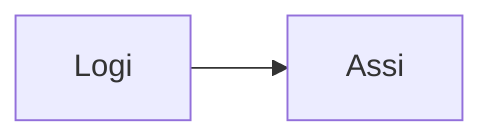

### 15. Logic: Compliance Checks
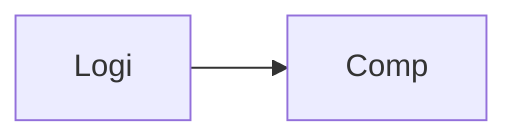

### 16. Logic: Performance Profiling
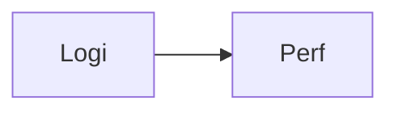

### 17. Architecture: Global Control Plane
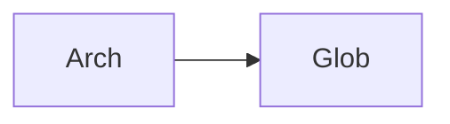

### 18. Architecture: Workplace Mesh
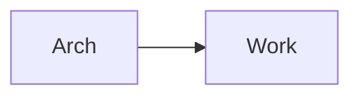

### 19. Architecture: Multi-Sink Reporting
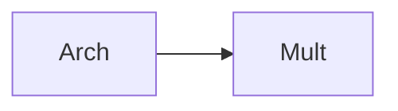

### 20. Pattern: Workspace-as-Code
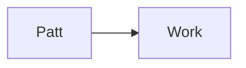

### 21. Pattern: Immutable Target Zones
```mermaid
graph LR
    P[Patt] --> I[Immu]
```

### 22. Pattern: Automated Provisioning
```mermaid
graph LR
    P[Patt] --> A[Auto]
```

### 23. Security: Signed Device Artifacts
```mermaid
graph LR
    S[Secu] --> S[Sign]
```

### 24. Security: RBAC Access Controls
```mermaid
graph LR
    S[Secu] --> R[RBAC]
```

### 25. Security: Secure Audit Record
```mermaid
graph LR
    S[Secu] --> S[Secu]
```

### 26. Feature: Fleet Heatmap UI
```mermaid
graph LR
    F[Feat] --> F[Flee]
```

### 27. Feature: Real-time Velocity Tailing
```mermaid
graph LR
    F[Feat] --> R[Real]
```

### 28. Feature: Auto-generated PCAPs
```mermaid
graph LR
    F[Feat] --> A[Auto]
```

### 29. Compliance: NIST Workspace Audits
```mermaid
graph LR
    C[Comp] --> N[NIST]
```

### 30. Compliance: Audit Trail Persistence
```mermaid
graph LR
    C[Comp] --> A[Audi]
```

### 31. Infrastructure: Redis State Cache
```mermaid
graph LR
    I[Infr] --> R[Redi]
```

### 32. Infrastructure: Postgres Fleet DB
```mermaid
graph LR
    I[Infr] --> P[Post]
```

### 33. Deployment: Kubernetes Workspace Pods
```mermaid
graph LR
    D[Depl] --> K[Kube]
```

### 34. Deployment: Multi-Region Wave Sync
```mermaid
graph LR
    D[Depl] --> M[Mult]
```

### 35. Monitoring: provisioning velocity KPI
```mermaid
graph LR
    M[Moni] --> P[Prov]
```

### 36. Monitoring: device compliance KPI
```mermaid
graph LR
    M[Moni] --> D[DevC]
```

### 37. UI: Unified Workspace Dashboard
```mermaid
graph LR
    U[UI] --> U[Unif]
```

### 38. UI: Identity Hub UI
```mermaid
graph LR
    U[UI] --> I[Iden]
```

### 39. UI: ROI View
```mermaid
graph LR
    U[UI] --> R[ROIV]
```

### 40. UI: Readiness Heatmap
```mermaid
graph LR
    U[UI] --> R[Read]
```

### 41. CI/CD: Wave validation pipeline
```mermaid
graph LR
    C[CICD] --> W[Wave]
```

### 42. CI/CD: Provisioning engine tests
```mermaid
graph LR
    C[CICD] --> P[Prov]
```

### 43. Strategy: Hybrid-First Foundation
```mermaid
graph LR
    S[Stra] --> H[Hybr]
```

### 44. Strategy: Data-Driven Workplace
```mermaid
graph LR
    S[Stra] --> D[Data]
```

### 45. Feature: Multi-Cloud Search Bridge
```mermaid
graph LR
    F[Feat] --> M[Mult]
```

### 46. Feature: Real-time Outage Alerts
```mermaid
graph LR
    F[Feat] --> R[Real]
```

### 47. Feature: UX Forecasting
```mermaid
graph LR
    F[Feat] --> U[UXFo]
```

### 48. Logic: Cost Comparison Engine
```mermaid
graph LR
    L[Logi] --> C[Cost]
```

### 49. Data Model: Fleet Task Entity
```mermaid
graph LR
    D[Data] --> F[Flee]
```

### 50. Enterprise Workplace Excellence
```mermaid
graph LR
    E[Entr] --> E[Work]
```

---

## 🛠️ Technical Stack & Implementation

### Platform Engine & APIs
- **Framework**: Python 3.11+ / FastAPI.
- **Identity Engine**: High-performance simulation of AD Connect bridging on-prem AD and Entra ID.
- **Provisioning Engine**: Carrier-grade orchestration of Windows 365 Cloud PC lifecycle.
- **Device Hub**: Intelligent management of Intune compliance and configuration profiles.
- **Networking Hub**: Advanced modeling of hybrid connectivity (VNet, VPN, DirectConnect).
- **Cost Engine**: Real-time estimation of Windows 365 licensing and usage costs.
- **Cache**: Redis for session tracking and real-time device status updates.
- **Persistence**: PostgreSQL for fleet metadata, identity objects, and audit trails.
- **Observability**: Prometheus/Grafana integration for workplace factory monitoring.

### Frontend (Hybrid Command Center)
- **Framework**: React 18 / Vite.
- **Theme**: Slate / Cyan (Modern EUC & Identity aesthetic).
- **Visualization**: Recharts for session trends and device compliance metrics.

### Infrastructure
- **Runtime**: AWS EKS (Kubernetes).
- **Deployment**: Helm charts for provisioning workers and identity gateways.
- **IaC**: Terraform (Modular with EUC Infrastructure focus).

---

## 🚀 Deployment Guide

### Local Development
```bash
# Clone the repository
git clone https://github.com/devopstrio/windows-365-hybrid.git
cd windows-365-hybrid

# Setup environment
cp .env.example .env

# Launch the Hybrid stack (API, Engines, DB, Redis, UI)
make up

# Sync Identity objects (AD -> AAD)
make sync

# Provision initial Cloud PCs
make provision

# Validate workplace architecture
make test
```
Access the Hybrid Dashboard at `http://localhost:3000`.

---

## 📜 License
Distributed under the MIT License. See `LICENSE` for more information.
